[Portfolio](https://living-portfolio-two.vercel.app) &nbsp;·&nbsp;
[instagram](https://www.instagram.com/quirkless_amogha/) &nbsp;·&nbsp;
[linkedin](https://www.linkedin.com/in/amogha-khare/) &nbsp;·&nbsp;
[email](mailto:amogha.khare@gmail.com)

> Final Year AI & Data Science student at VIIT, Pune 
> Data Science Intern at Wolters Kluwer.
> Small, sharp tools over big vague ideas.

I build fast, test on real users, and kill what doesn't work. Right now that's 
[Indie Chess](https://github.com/AmoghaK1/Chess-Engine) — a complete chess game coded in python. The best part 
every single line is handwritten. No AI, No vibecode, just pure logic.

<!-- <samp>python &nbsp; typescript &nbsp; javascript &nbsp; react &nbsp; node &nbsp; three.js &nbsp; fastapi &nbsp; postgres &nbsp; docker &nbsp; git &nbsp; linux</samp> -->

<table border="0" cellspacing="0" cellpadding="12" style="border:none; background:transparent;">
<tr>
  <td align="center" style="border:none; padding: 0 24px;">
     
     AI / ML
  </td>
  <td align="center" style="border:none; padding: 0 24px;">
     
     Full Stack
  </td>
  <td align="center" style="border:none; padding: 0 24px;">
     
     Data & Infra
  </td>
  <td align="center" style="border:none; padding: 0 24px;">
     
     Daily Drivers
  </td>
</tr>
</table>

**[virtual-stylist](https://github.com/AmoghaK1/Virtual_Stylist_ML_Model)** &nbsp;·&nbsp; <samp>machine learning, python</samp> AI-powered virtual styling system for personalized fashion recommendations 
using machine learning and visual features.

**[tpo-tracker](https://github.com/AmoghaK1/TPO-Tracker)** &nbsp;·&nbsp; <samp>full stack</samp> 
Placement tracking platform for managing student applications, company drives, 
and recruitment progress in one place.

**[rag-system](https://github.com/AmoghaK1/LLM-Powered-Query-Retrieval-System)** &nbsp;·&nbsp; <samp>llm, rag</samp> 
LLM-powered retrieval system that finds relevant information from documents 
and generates context-aware answers.

**[student-management-system](https://github.com/AmoghaK1/User-Management-System-NDA)** &nbsp;·&nbsp; <samp>full stack</samp> 
Interactive dashboard built to improve efficiency, manage students, pay course fees and download 
syllabus.

